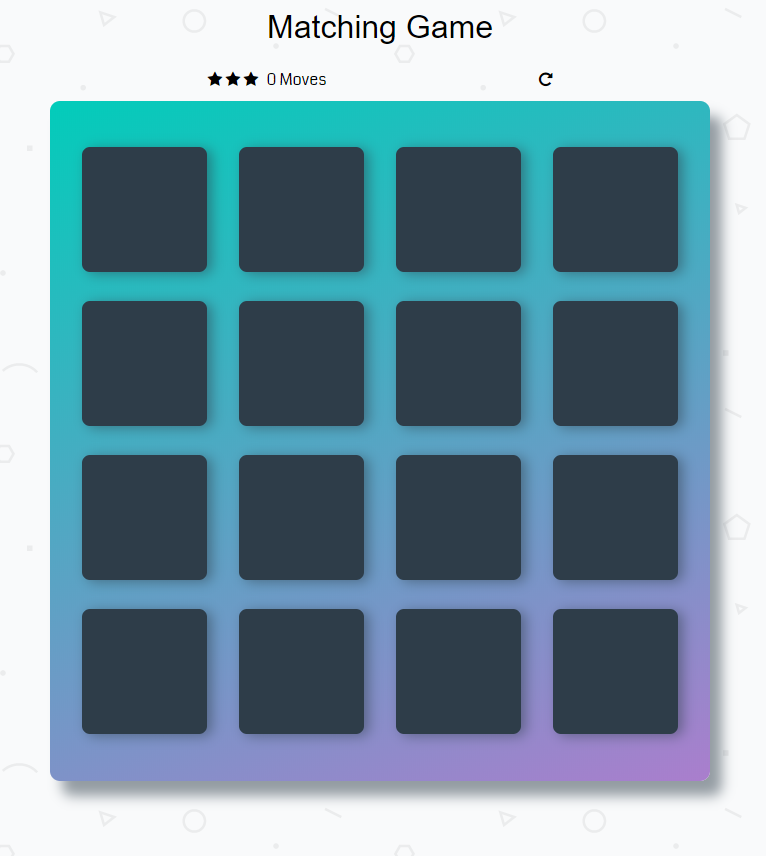
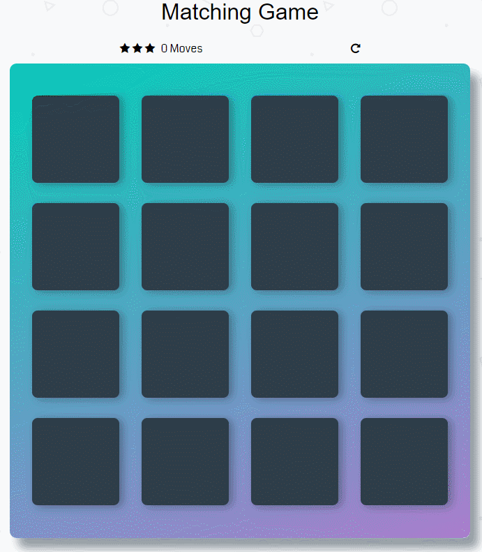
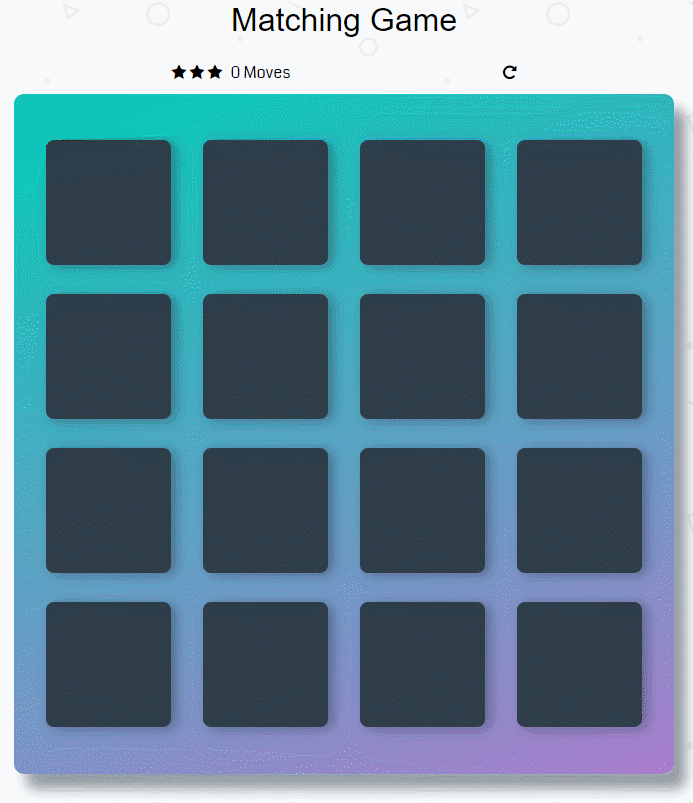

# Memory-Game
My memory game project.
### Memory game is a brain-testing game where user is provide with 16 cards (8 pairs) and has to match two cards at a time.

Here is what the game board looks like!

### Different parts of the game

1. Matched Cards : when the user clicks on two cards and if they match their color will change to dark green and then again changes to their orignal color after one second and the cards will remain open.

2. Unmatced Cards: When the two clicked cards do not match, the cards will shake and their color will change to red, and the cards will disappear.

3. Moves : When the two cards are clicked at a time, no. of moves will be increasing whether the cards are matched or not.

4. Restart : When all cards are matched, the alert will pop-up saying that "You Won", and when restart button is clicked, the game will start again with shuffled cards and the number of moves will start again from 0.

### How to play

1. The player must click on two cards in order to check whether the two cards match or no.
2. If the cards match, both cards stay flipped over.
3. If the cards do not match, the cards will be turned over and player has to select two new cards to continue playing game.
4. Once all 8 pairs of cards are matched, user gets pop-up alert that "You Won".

### Planned Changes

1. Rating stars will be added to rate the player"s performace depending upon how many moves the user plays to match the cards.
2. Timer will be added which will be coonected to rating the perfrmance depending upon how much time the user takes to finish the game.

### Author
__ARSHPREET KAUR__

 
